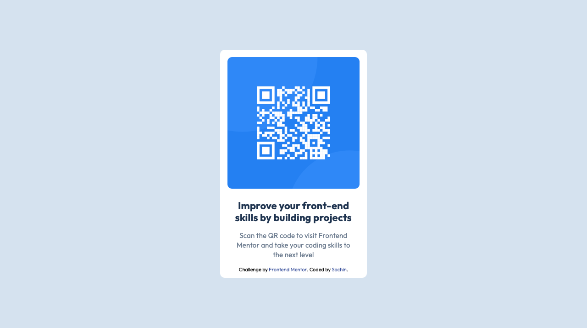

# Frontend Mentor - QR code component solution

This is a solution to the [QR code component challenge on Frontend Mentor](https://www.frontendmentor.io/challenges/qr-code-component-iux_sIO_H). Frontend Mentor challenges help you improve your coding skills by building realistic projects.

## Screenshot

Screenshot of actual view of my code in laptop dimensions.

Screenshot of actual view of my code in mobile view.

### My Process

1. Alinged the items/content both vertically and horizontally center by using ()

2. Created a Wrapper for my contents and alinged in center at flex-start and also direction of items to column by using flex box:

3. After that just have to add font-size, background, padding, margin and border-radius and some little touchups.
